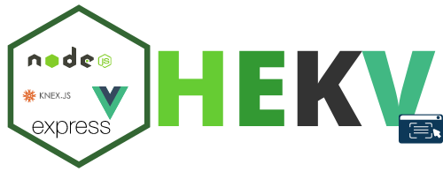

<h1>HEKV</h1>

<h3 align="center">Hibernated express + knex + vue starter project</h3>

## **Client-Side**

Client component of HEKV (Hibernate Express Knex Vue) starter project. this app can be used as single client or part of your micro service architecture and you can have different instances run different clients
